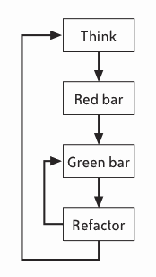

### Test Driven Development
1. #### What is test-driven development ?
   Test-driven development, or TDD, is a rapid cycle of test, code, and refactoring. When adding a feature, a pair may perform dozens of these cycles, implementing and refining the software in baby steps until there is nothing left to add and nothing left to take away. Research shows that TDD substantially reduces the incidence of defects. When used properly, it also helps improve your design, documents your public interface, and guards against future mistakes.

   TDD isn't perfect, of course. TDD is difficult to use on legacy codebases.
        
2. #### Why use test-driven Development ?
   Back in the days of punchcards, programmers laboriously hand-checked their code to make sure it would compile. A compile error could lead to failed batch jobs and intense debug sessions to look for the misplaced charactor.

   Getting code to compile isn't such a big deal anymore. Most IDEs check your syntax as you type, and some even compile every time you save. The feedback loop is so fast that errors are easy to find and fix. If something doesn't compile, there isn't much code to check.

   Test-driven development applies the same principle to programmer intent. Just as modern compilers provide more feedback on the syntax of your code, TDD cranks up the feedback on the execution of your code. Every few minutes-as often as every 20 or 30 seconds-TDD verifies that the code does what you think it should do. If something goes wrong, there is only a few lines code to check. Mistakes are easy to find and fix.

   TDD uses an approach similar to double-entry bookkeeping. You communicate your intentions twice, staing the same idea in different ways: first with a test, then with production code. When they match, it's likely they were both coded correctly. If they don't, there's a mistake somewhere.

   In TDD, the tests are writen from the perspective of a class's public interface. They focus on the class' behavior, not its implementation. Programmers write each test before the corresponding production code. This focuses their attention on creating interfaces that are easy to use rather than easy to implement, which improves the design of interface.

   After TDD is finished, the test remain. They're checked in with the rest of the code, and they act as living documentation of the code. More importantly, programmers run all of the tests with (nearly) every build, ensuring that code continues to work as originally intened. If someone accidentally changes the ocde's behavior-for example, with a misguided refactring-the tests fail, signaling the mistake.

3. #### How to pratice test-driven development ?
   To use TDD, follow the "red, green, refactor" cycle.

   

4. #### References
   ["The Art of Agile Development"-"Test-Driven Development"](https://www.jamesshore.com/Agile-Book/test_driven_development.html)