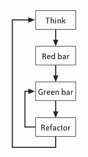

### 测试驱动开发 Test-Driven Development
1. #### 什么是测试驱动开发
   测试驱动开发，即TDD，是一种持续地运用编写测试、编写实现和重构代码等手段增量构建软件的软件开发方法。
2. #### 为什么使用测试驱动开发
   现代集成开发环境已经可以在程序员输入代码的同时，给出错误提示，或者优化建议，反馈时间的缩短使错误更容易被发现和修复。现代编译器提供代码语法上的反馈，而测试驱动开发提供代码运行时的反馈，保证代码按照我们所期望的方式运行，即使程序运行出错，无法通过测试，需要排查的代码量也很少。除了快速获取反馈，尽早修复错误，测试驱动开发还带来了一些其他的好处。首先，在测试驱动开发中，测试代码和实现代码通过两种不同的方式表达了相同的思想，确保代码体现程序员的意图，其次，编写测试只关注行为，不考虑实现，编写的接口更易于使用而不是易于实现，这就使得设计的接口更好，最后，测试驱动开发结束后，测试代码被保留了下来，在每次构建程序时都会执行，确保了程序按照之前设计的方式运行，如果有其他人不小心更改了代码，导致测试无法通过，能够及时获得提示

3. #### 如何实践测试驱动开发
   使用TDD，其实就是使用”红，绿，重构“的开发方法，如下图所示
   